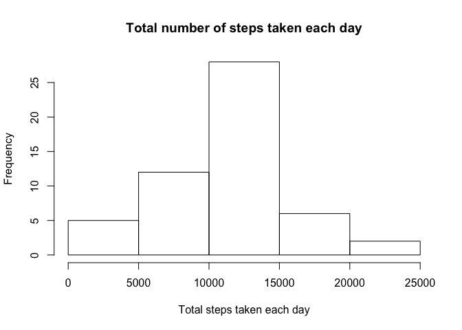
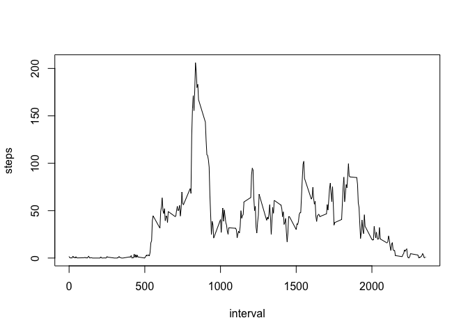
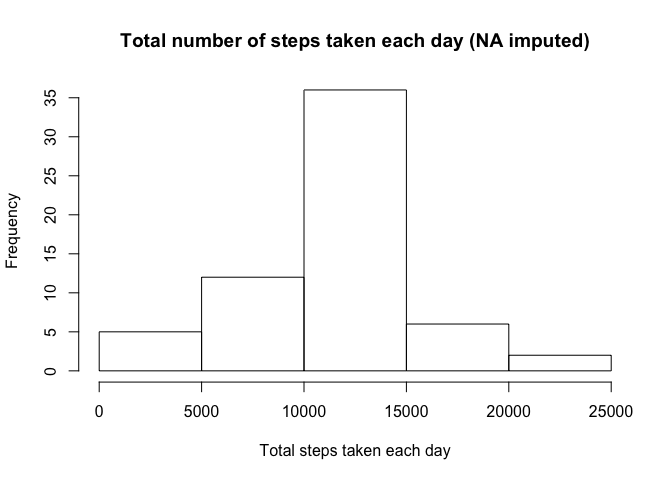
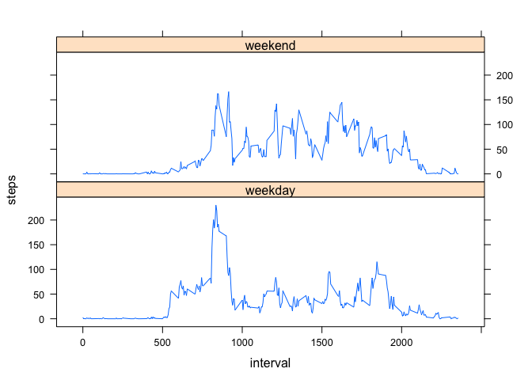

# Reproducible Research: Peer Assessment 1
8/18/2018  


## Loading and preprocessing the data


```r
activity<-read.csv('activity.csv')
```

## What is mean total number of steps taken per day?

```r
stepsbyday<-aggregate(steps~date,data=activity,FUN=sum,na.action=na.omit)
hist(stepsbyday$steps, main='Total number of steps taken each day', xlab='Total steps taken each day')
```

<!-- -->

```r
meansteps<-round(mean(stepsbyday$steps))
mediansteps<-round(mean(stepsbyday$steps))
```
The mean of the total number of steps taken each day is 10766.  
The median of the total number of steps taken each day is 10766. 

## What is the average daily activity pattern?
1. make a time series plot

```r
stepsbyinterval<-aggregate(steps~interval,data=activity,FUN=mean,na.action=na.omit)
plot(steps~interval, data=stepsbyinterval,type='l')
```

<!-- -->

```r
maxinterval<-stepsbyinterval$interval[which.max(stepsbyinterval$steps)]
```
2. The 835th 5-minute interval, on average across all the days in the dataset, contains the maximum number of steps.

## Imputing missing values

```r
narows<-table(is.na(activity$steps))[2]
```
1. Total number of missing values in the dataset is 2304
2. The strategy to fill in the missing value for a given interval is to use the mean of that 5-minute interval. 
3. After filling the missing values, I created a new dataset, activity2.

```r
activity2<-activity
for (i in 1:nrow(activity2)){
  if(is.na(activity2$steps[i]))
  {
    key<-activity2$interval[i]
    activity2$steps[i]<-stepsbyinterval$steps[stepsbyinterval$interval==key]
  }
}
summary(activity2)
```

```
##      steps                date          interval     
##  Min.   :  0.00   2012-10-01:  288   Min.   :   0.0  
##  1st Qu.:  0.00   2012-10-02:  288   1st Qu.: 588.8  
##  Median :  0.00   2012-10-03:  288   Median :1177.5  
##  Mean   : 37.38   2012-10-04:  288   Mean   :1177.5  
##  3rd Qu.: 27.00   2012-10-05:  288   3rd Qu.:1766.2  
##  Max.   :806.00   2012-10-06:  288   Max.   :2355.0  
##                   (Other)   :15840
```
4. Make a histogram of the total number of steps taken each day and Calculate and report the mean and median total number of steps taken per day.

```r
stepsbyday2<-aggregate(steps~date, data=activity2, FUN=sum)
hist(stepsbyday2$steps,main='Total number of steps taken each day (NA imputed)', xlab='Total steps taken each day')
```

<!-- -->

```r
meansteps2<-round(mean(stepsbyday2$steps))
mediansteps2<-round(mean(stepsbyday2$steps))
```

After the imputation, the mean of the total number of steps taken each day is 10766. The median of the total number of steps taken each day is 10766. The statement that imputation does not affect these results is TRUE.

## Are there differences in activity patterns between weekdays and weekends?


```r
activity2$date<-as.Date(activity2$date)
```

```
## Warning in strptime(xx, f <- "%Y-%m-%d", tz = "GMT"): unknown timezone
## 'zone/tz/2018e.1.0/zoneinfo/America/Los_Angeles'
```

```r
activity2$weekdays<-weekdays(activity2$date)
activity2$weekdays2[activity2$weekdays%in%c('Monday','Tuesday',
                                            'Wednesday','Thursday',
                                            'Friday')]<-'weekday'
activity2$weekdays2[activity2$weekdays%in%c('Saturday','Sunday')]<-'weekend'
stepsbyinterval2<-aggregate(activity2$steps,by=list(activity2$interval,activity2$weekdays2),FUN=mean)
colnames(stepsbyinterval2)<-c('interval','weekday','steps')
library(lattice)
xyplot(steps~interval|weekday, data=stepsbyinterval2, type='l',layout=c(1,2))
```

<!-- -->
